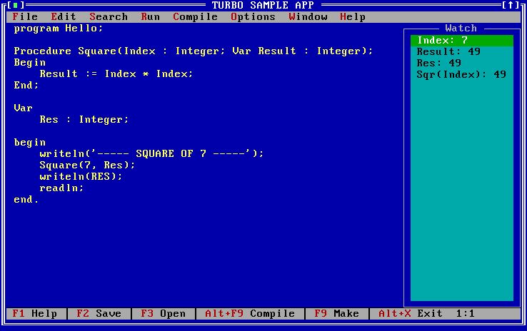
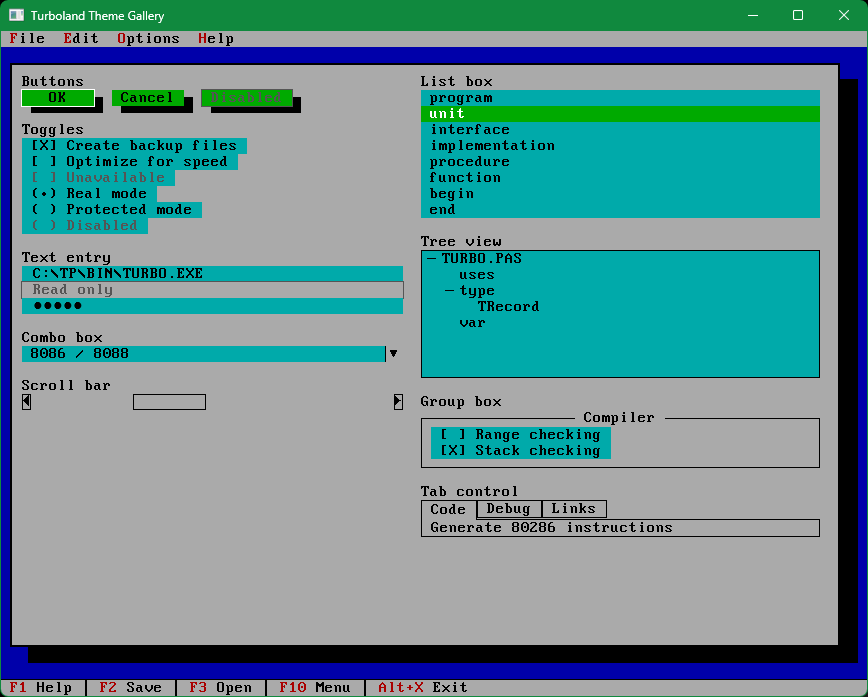

# Turboland Theme for WPF

A reusable WPF theme that gives a modern .NET desktop application the look of the
classic DOS IDEs - VGA palette, box-drawing frames, hard
shadows, and a strict character grid - without giving up standard Windows behavior.

The theme re-templates stock WPF controls. It does not replace them.





## Features

- **Complete control coverage** - Button, CheckBox, RadioButton, TextBox, PasswordBox,
  Menu, ListBox, ComboBox, TreeView, TabControl, GroupBox, ScrollBar, StatusBar and
  Window are all themed by implicit styles.
- **Two modes** - `Authentic` reproduces the original palette exactly. `Accessible`
  keeps the same 16 colors but re-maps them so every rendered text pair meets
  WCAG AA, and no cue is carried by color alone.
- **Integer scaling** - every measurement is a whole number of 9x16 character cells,
  scaled by 1x-4x. No fractional pixels, no blurry text.
- **Bundled bitmap-style font** - Px437 IBM VGA 9x16, with grayscale rendering and
  layout rounding applied for you.
- **Native window behavior** - the frame is drawn in the client area, but resize,
  maximise, Snap Layouts and the taskbar all still work.
- **No hardcoded values** - the theme is driven entirely by named design tokens you
  can read, reuse or override.

## Quick start

Reference `TurbolandTheme.Wpf`, then apply the theme at startup:

```csharp
using System.Windows;
using Theme = TurbolandTheme.Wpf.TurbolandTheme;

public partial class App : Application
{
    protected override void OnStartup(StartupEventArgs e)
    {
        base.OnStartup(e);

        Theme.Apply(this, TurbolandTheme.Core.ThemeMode.Authentic);

        var window = new MainWindow();
        Theme.ApplyTo(window);   // required: implicit styles do not reach a derived Window
        window.Show();
    }
}
```

That is the whole integration. Every stock control in `MainWindow` is now themed.

See **[docs/getting-started.md](docs/getting-started.md)** for the next steps.

## Documentation

| Guide | Covers |
|---|---|
| [Getting started](docs/getting-started.md) | Installing, applying the theme, your first window |
| [Modes and scaling](docs/modes-and-scaling.md) | Authentic vs Accessible, DPI and the scale factor |
| [Design tokens](docs/design-tokens.md) | Every color, metric, font and flag token |
| [Controls](docs/controls.md) | `TurbolandWindow`, `TurbolandDialog`, `StatusBarHint` and friends |
| [Layout on the character grid](docs/character-grid.md) | `CellSize`, spacing rules, chrome that paints out of bounds |
| [Troubleshooting](docs/troubleshooting.md) | Symptoms, causes and fixes for the common traps |

## Repository layout

```text
src/
  TurbolandTheme.Core/      Palette, cell metrics and typography constants (netstandard2.0)
  TurbolandTheme.Wpf/       Resource dictionaries, control templates, custom controls
  TurbolandTheme.Gallery/   Visual test app - every themed control on one screen
  SampleApp/              A working DOS style IDE shell
tests/
  TurbolandTheme.Tests.VisualRegression/
  TurbolandTheme.Tests.UiAutomation/
```

## Building

Requires the .NET 9 SDK and Windows.

```powershell
dotnet build
dotnet test
```

Both demo apps take an optional mode and scale factor on the command line:

```powershell
dotnet run --project src/TurbolandTheme.Gallery -- accessible 2
dotnet run --project src/SampleApp -- authentic 1
```

## Credits

The bundled font is **Px437 IBM VGA 9x16** from
[The Ultimate Oldschool PC Font Pack](https://int10h.org/oldschool-pc-fonts/) by VileR,
used under [CC BY-SA 4.0](https://creativecommons.org/licenses/by-sa/4.0/).

This project is an independent tribute to the look of 1990s DOS text-mode IDEs. It is
not affiliated with or endorsed by any IDE vendor.

---  
  
>If you enjoy this project, please consider:

<a href="https://www.buymeacoffee.com/mighty_studios" target="_blank">
  
</a>

<small>(The joy I get from a free latte is incredible)</small> 